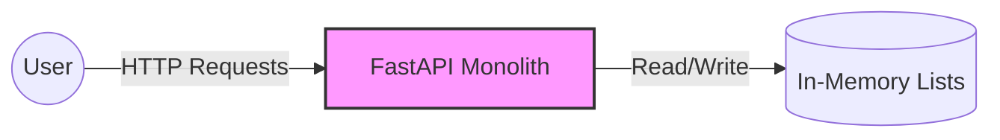
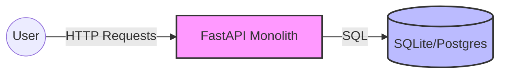
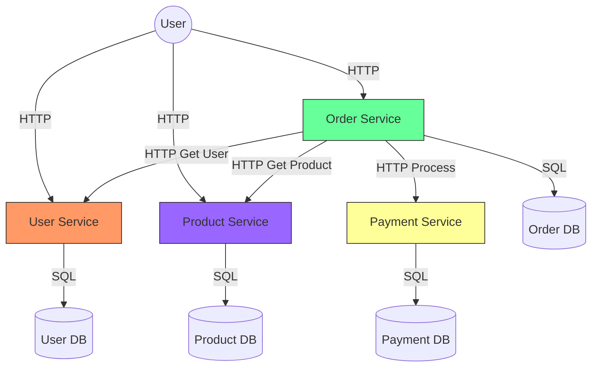
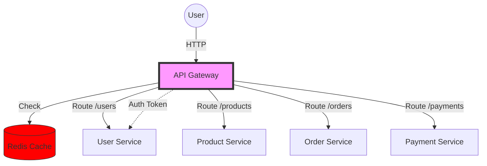
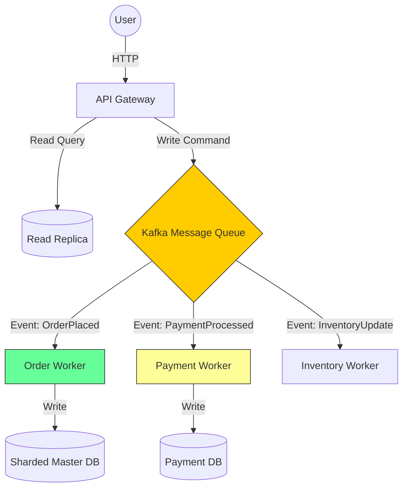

# E-Commerce Evolution: From 1 to 1 Million Users

This project demonstrates the evolution of an e-commerce backend from a simple script to a complex, scalable microservices architecture. Each stage represents a branch in this repository.

## The Goal
Build a robust e-commerce platform with 4 core domains:
1.  **Users** (Auth, Profiles)
2.  **Products** (Catalog, Search)
3.  **Orders** (Cart, Checkout)
4.  **Payments** (Transactions, Inventory checks)

## Evolution Stages

### Stage 1: The MVP (1 User)
*   **Architecture**: Monolithic (Single Process).
*   **Database**: In-Memory Lists.
*   **Focus**: Core business logic, basic API endpoints.
*   **Tech**: Python (FastAPI), Local Storage.
*   **Branch**: `stage-1-mvp`
*   **Scenario**: Validating the idea. Simplicity is key.

### Stage 2: The Startup (10-100 Users)
*   **Architecture**: Monolithic (Single Process).
*   **Database**: PostgreSQL (Client-Server Database).
*   **Focus**: Data persistence, schema structure, basic concurrency.
*   **Tech**: Docker for DB, SQLAlchemy ORM.
*   **Branch**: `stage-2-database`
*   **Scenario**: Small user base, need reliable data storage.

### Stage 3: The Growth (100-1,000 Users) - Microservices Split
*   **Architecture**: Microservices (4 logical services).
*   **Database**: Separate Databases for each service (Database-per-Service pattern).
*   **Focus**: Placing boundaries, Docker Compose orchestration.
*   **Tech**: Docker Compose, 4 x FastAPI instances, Internal HTTP calls.
*   **Branch**: `stage-3-microservices`
*   **Scenario**: Different teams working on different features, need decoupling.

### Stage 4: The Scale (10,000 Users) - Gateway & Caching
*   **Architecture**: Microservices with API Gateway.
*   **Infrastructure**: API Gateway, Redis Cache.
*   **Focus**: Rate Limiting, Response Caching, Centralized Authentication.
*   **Tech**: Nginx/Kong or Custom Gateway, Redis.
*   **Branch**: `stage-4-gateway`
*   **Scenario**: Traffic spikes, need to protect backend services.

### Stage 5: The Enterprise (1 Million+ Users) - Sharding & Async
*   **Architecture**: Event-Driven Microservices.
*   **Infrastructure**: Kafka/RabbitMQ, Database Sharding, Read Replicas.
*   **Focus**: High Availability, Eventual Consistency, Horizontal Scaling.
*   **Tech**: Message Queues, Horizontal Partitioning (Sharding).
*   **Branch**: `stage-5-enterprise`
*   **Scenario**: Global scale, massive transaction volume.

## How to use
Switch branches to see how the code evolves!
