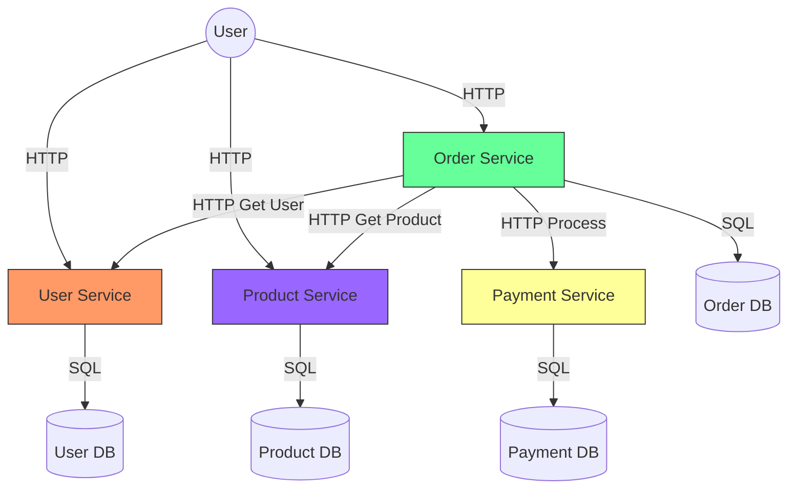

# Stage 3: The Growth (Microservices)

This stage represents the transition from a monolithic architecture to a distributed microservices system.

## 🏗 Architecture Overview

In this stage, we have decomposed the monolithic application into **4 independent services**.
These services run in separate containers and communicate over HTTP (REST) within a private Docker network.

### High-Level Diagram


### Components

1.  **User Service** (`:8001`)
    *   **Responsibility**: Manages user identities (Usernames, Emails).
    *   **Database**: `users.db` (SQLite).
    *   **Reason**: Auth is a critical, high-read domain. Separating it allows us to optimize it differently from the heavy Order processing logic.

2.  **Product Service** (`:8002`)
    *   **Responsibility**: Manages the catalog (Names, Prices, Inventory).
    *   **Database**: `products.db` (SQLite).
    *   **Reason**: The catalog changes infrequently but is read constantly. In the future, this service will benefit most from Caching (Redis).

3.  **Payment Service** (`:8004`)
    *   **Responsibility**: Processes transactions.
    *   **Database**: `payments.db` (SQLite).
    *   **Reason**: Isolation is key here. If the Payment Gateway is slow, we don't want it to block the User Login screen.

4.  **Order Service** (`:8003`)
    *   **Responsibility**: Orchestration. It acts as the "glue".
    *   **Database**: `orders.db` (SQLite).
    *   **Flow**:
        1.  Client sends `POST /orders`.
        2.  Order Service calls `GET :8001/users/{id}` to verify user exists.
        3.  Order Service calls `GET :8002/products/{id}` to get the current price.
        4.  Order Service calculates Total Price.
        5.  Order Service calls `POST :8004/payments` to charge money.
        6.  Order saved to DB.
    *   **Challenge**: This is a "Synchronous Chain". If *any* service (User, Product, Payment) is down, the Order fails. (We will fix this in Stage 5).

---

## 🚀 How to Run

1.  **Start the Cluster**
    ```bash
    docker-compose up --build
    ```

2.  **Verify Services**
    *   User Service: `http://localhost:8001/docs`
    *   Product Service: `http://localhost:8002/docs`
    *   Order Service: `http://localhost:8003/docs`
    *   Payment Service: `http://localhost:8004/docs`

## 🧪 Testing the Flow

Since there is no UI yet, use `curl` or Postman:

1.  **Create a User**
    ```bash
    curl -X POST "http://localhost:8001/users" \
         -H "Content-Type: application/json" \
         -d '{"username": "alice", "email": "alice@example.com"}'
    
    # Response: {"id": 1, ...}
    ```

2.  **Create a Product**
    ```bash
    curl -X POST "http://localhost:8002/products" \
         -H "Content-Type: application/json" \
         -d '{"name": "MacBook", "price": 2000, "description": "M3 Pro"}'
    
    # Response: {"id": 1, ...}
    ```

3.  **Place an Order** (Triggers Inter-Service Communication)
    ```bash
    curl -X POST "http://localhost:8003/orders" \
         -H "Content-Type: application/json" \
         -d '{"user_id": 1, "product_id": 1, "quantity": 1}'
         
    # Response: {"status": "confirmed", "total_price": 2000, ...}
    ```

## ❓ Why this Architecture? (Rationale)

### Why Split?
*   **Independent Deployments**: We can deploy a bugfix to the `Payment` service without restarting the `Product` service.
*   **Technology Heterogeneity**: If needed, the `Payment` service could be rewritten in Go or Java for performance, while `Products` stays in Python.

### The Cost of Microservices
*   **Complexity**: We now have 4 services to monitor instead of 1.
*   **Latency**: Internal HTTP calls are slower than internal function calls.
*   **Data Consistency**: We can't use a single "Transaction" across databases. If Payment succeeds but Order Save fails, we have a problem (Distributed Transaction problem).

*See `MASTER_PLAN.md` for the full evolution story.*
