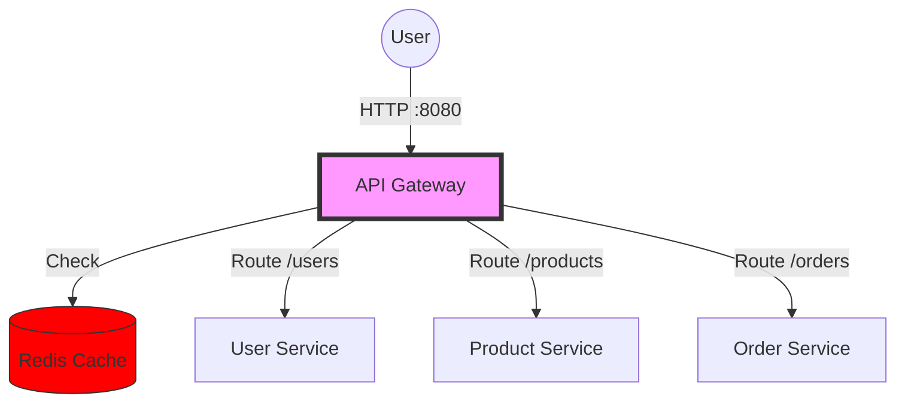

# Stage 4: The Scale (API Gateway & Caching)

We have introduced an **API Gateway** and **Redis Caching**.

## 🏗 Architecture Overview

*   **API Gateway**: The Single Entry Point. Clients only talk to `localhost:8080`.
*   **Redis**: Caches `GET /products` requests to reduce load on the Product Service.
*   **Security**: Internal services (`users`, `products`, etc.) are hidden from the internet (no ports mapped in `docker-compose.yml`).

### High-Level Diagram


## 🚀 How to Run

1.  **Start the Cluster**
    ```bash
    docker-compose up --build
    ```

## 🧪 Testing the Flow & Cache

1.  **Fetch Products (Cache Miss)**
    ```bash
    curl http://localhost:8080/products
    # Logs: "Cache Miss. Fetching from Product Service..."
    ```

2.  **Fetch Products Again (Cache Hit)**
    ```bash
    curl http://localhost:8080/products
    # Logs: "Cache Hit! Returning data from Redis."
    # Response is INSTANT.
    ```

3.  **Place Order (Routed via Gateway)**
    ```bash
    curl -X POST "http://localhost:8080/orders" \
         -H "Content-Type: application/json" \
         -d '{"user_id": 1, "product_id": 1, "quantity": 1}'
    ```

## Key Benefits
*   **Simplified Usage**: Client only needs `localhost:8080`.
*   **Performance**: Product catalog is cached.
*   **Security**: Backend services are unreachable directly.
